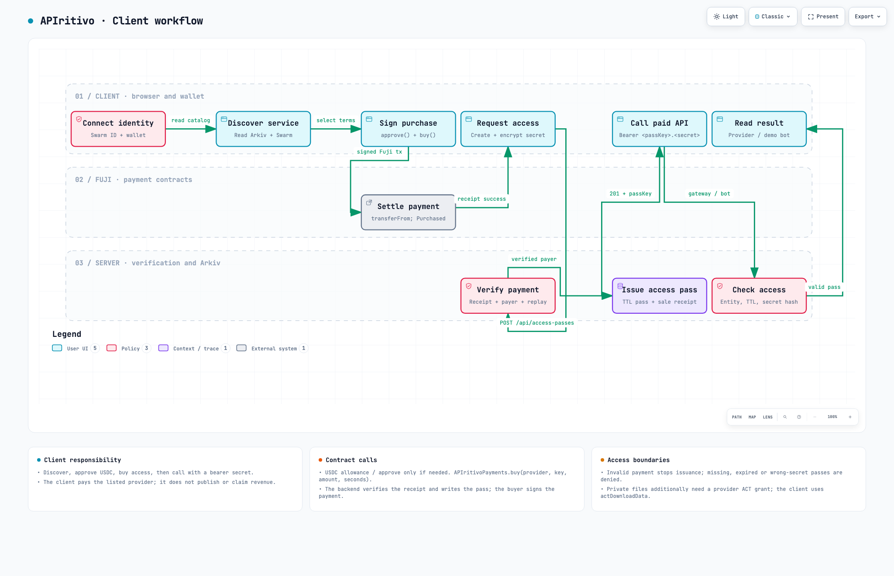
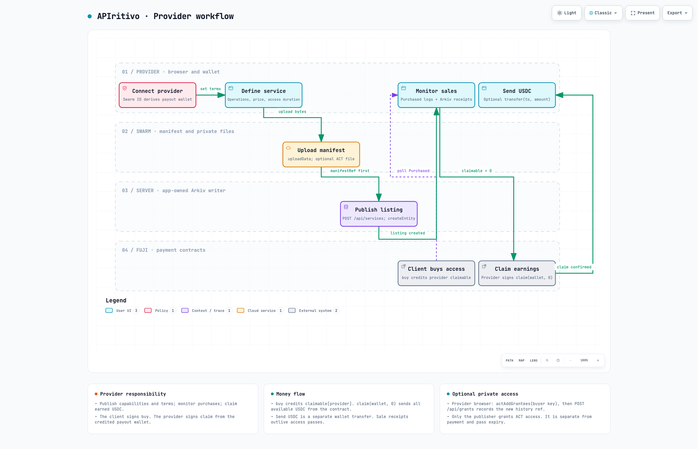

<picture>
  <source media="(prefers-color-scheme: dark)" srcset="apps/web/public/brand/logos/apiritivo-logo-dark.png">
  
</picture>

# APIs for the agent era.

**Discover APIs. Buy access. Start building.**

APIritivo is a service marketplace for developers and AI agents. Providers publish machine-readable APIs and earn USDC; clients discover operations, purchase timed access, and call services with verifiable credentials.

Built at **ETH Rome 2026** · Swarm ID · Swarm · Arkiv · Avalanche Fuji

[Run locally](#run-locally) · [Architecture](#architecture) · [Demo walkthrough](docs/JUDGE-WALKTHROUGH.txt) · [Technical guide](docs/technical-guide.md) · [UX flows](docs/ux-flows/UX-FLOWS.md)

[](docs/images/client-workflow.png)

[](docs/images/provider-workflow.png)

## Run locally

### Requirements

- **Git, Bun 1.3+ and Node.js 20+.** Foundry is optional, for Solidity development and tests.
- **Swarm ID** to publish. Allow its sign-in popup; the app derives the provider's payout wallet from the identity.
- **A browser wallet** (MetaMask, Rabby or Core) on Avalanche Fuji to buy access. Swarm ID is optional for clients and only needed to open private files: at purchase the paying wallet signs which Swarm ID key may receive the file, and only that key is ever granted. The file follows that Swarm ID, not the wallet.
- **Test funds:** [GLM on Arkiv Tiramisu](https://hub.arkiv.network/faucet) for the server writer; [AVAX](https://core.app/tools/testnet-faucet/) for wallet gas and [USDC](https://faucet.circle.com/) for purchases on Avalanche Fuji.

### Quick start

```bash
git clone https://github.com/pf55351/apiritivo-eth-26.git
cd apiritivo-eth-26
bun install
cp .env.example apps/web/.env.local
bun dev
```

Open **[localhost:3000](http://localhost:3000)**. Choose **Provider** to publish an API or **Client** to browse and buy. Providers fund the Swarm-derived wallet shown in the app; clients fund the wallet they connect.

The example config includes the gateways, deployed payment contract, and a **public testnet demo writer key**. Use it only on testnets. For your own writer, set `ARKIV_WRITER_PRIVATE_KEY` in `apps/web/.env.local` and fund its address with GLM. See [all environment options](.env.example).

| Command | Purpose |
| --- | --- |
| `bun demo:check` | Check writer funding, RPCs, payment contract, and a small Swarm test upload |
| `bun typecheck && bun lint && bun test` | Check TypeScript, Biome + ESLint, and application tests |
| `bun check:fix` | Format and auto-fix the whole monorepo with Biome |
| `bun test:contracts` | Run Solidity tests with Foundry |
| `bun run build` | Build for production; stop `bun dev` first because both use `.next` |

### Deploy on Vercel

The app is a standard Next.js build; only `apps/web` is deployed.

| Setting | Value |
| --- | --- |
| Root Directory | `apps/web` (keep "Include source files outside of the Root Directory" on) |
| Install Command | `bun install` (the root `bun.lock` is detected) |
| Build Command | `next build` (workspace packages are transpiled by Next, no separate build) |
| Production Branch | the branch that contains this README |

Environment variables to set in the project (see [.env.example](.env.example)): `ARKIV_WRITER_PRIVATE_KEY` (required, server only), `NEXT_PUBLIC_PAYMENTS_CONTRACT_ADDRESS` (required for contract mode), and optionally `AVALANCHE_FUJI_RPC_URL` for a dedicated Fuji RPC and `NEXT_PUBLIC_ENS_CHAIN` (`sepolia` default, or `mainnet`) for ENS resolution. Every other `NEXT_PUBLIC_*` has a default in the code.

Swarm ID scopes the app secret to the page origin: the same identity gets a different derived wallet and pass key on every domain, including each preview URL. Fund and publish on one stable production domain and run the demo there.

## Architecture

**Next.js 15 + React 19**, organized as a **Bun / Turborepo monorepo**. Shared packages isolate the SDKs; the backend verifies payments and writes registry entities.

| Layer | Responsibility |
| --- | --- |
| **Swarm ID** | Provider identity, derived payout wallet, ACT keys for private files |
| **Browser wallet** | Client identity (MetaMask, Rabby, Core): pays USDC and seals the API key with one signature |
| **Swarm** | Immutable API manifests and optional encrypted private files |
| **Arkiv · Tiramisu** | Permanent listings and sale receipts; access passes with a TTL |
| **Avalanche · Fuji** | USDC settlement through `APIritivoPayments`: `approve` → `buy` → provider `claim` |
| **ENS · Sepolia** | Optional `.eth` name per API: `addr` → payout wallet, `text` → Arkiv service id, `contenthash` → `bzz://` manifest on Swarm. Read-only, verified by the server |
| **Next.js API** | Publish listings, verify purchases, issue passes, record grants, and enforce API access |

### Two workflows

| Client | Provider |
| --- | --- |
| Discover a listing and its manifest | Define operations, price, and access duration |
| Connect MetaMask or Rabby on Fuji, approve USDC and call `buy()` | Upload the manifest to Swarm, then publish on Arkiv |
| Receive an expiring Arkiv access pass after payment verification | Monitor purchases and optionally grant private-file access |
| Call the gateway with `Bearer <passKey>.<secret>` | Call `claim(wallet, 0)` to withdraw all available earnings |
| [Explore client workflow →](docs/architecture/client.html) | [Explore provider workflow →](docs/architecture/provider.html) |

The gateway checks the pass, expiry, and secret hash before calling the manifest's endpoint. The current publish form omits the endpoint, so newly published services use the demo bot. Passes expire; sale receipts remain. Private-file grants are managed separately.

**Payment contract · Fuji `43113`:** [`0x4e98f464dc8c667e3b0fd3092e0f2d4585702fa3`](https://testnet.snowtrace.io/address/0x4e98f464dc8c667e3b0fd3092e0f2d4585702fa3). Clearing `NEXT_PUBLIC_PAYMENTS_CONTRACT_ADDRESS` enables direct USDC transfers; restart `bun dev` after changing it.

### ENS: a name for every API

A `.eth` name is a pointer to everything a machine needs: the payout wallet, the Arkiv listing and the Swarm manifest. Swarm is a content type ENS understands natively (EIP-1577 `bzz://`), so no new contract is involved.

```text
prova-api.apiritivo.eth
  addr                        0xE20a…21f8            payout wallet        ← checked by POST /api/services before publishing
  text  com.apiritivo.service  prova-api-65ee         Arkiv service_id     ← checked on the service page
  contenthash                 bzz://<manifest_ref>   manifest on Swarm    ← checked on the service page
```

1. The provider owns a name (free on the Sepolia ENSv2 beta app [app.ens.dev](https://app.ens.dev), paid in mintable MockUSDC plus Sepolia ETH for gas) and sets its ETH address to the Swarm wallet shown in the publish form.
2. Publishing with the optional **ENS name** field: the server resolves the name and refuses it unless `addr(name)` equals the payout address. The name is stored on Arkiv as `ens_name`.
3. The service page shows an ENS panel with ✓ / ○ per record; in provider view it lists the exact values to paste into the ENS app. Marketplace cards carry the badge (◐ address verified, ✓ fully resolvable).
4. Machines resolve the name: `bun tools/call-service.ts prova-api.apiritivo.eth "<key>"` reads the text record (Arkiv `ens_name` as fallback) and calls the gateway.

**The platform name exists:** [`apiritivo.eth`](https://app.ens.dev/apiritivo.eth) is registered on the Sepolia ENSv2 beta by the Arkiv writer, with its own resolver [`APIritivoResolver`](contracts/src/APIritivoResolver.sol) at [`0xe64784509db0ea3d429f782c413ce1c6c0c95a50`](https://sepolia.etherscan.io/address/0xe64784509db0ea3d429f782c413ce1c6c0c95a50) and `addr` → the provider's Swarm wallet. Records are written with `bun tools/ens-register.ts records apiritivo.eth --service <id> --manifest <ref>`; the beta's shared PublicResolverV2 refuses writes even from owners, hence the dedicated resolver. The web app itself never writes ENS. Minting `<service-id>.apiritivo.eth` per service is the next step.

**Demo trust model:** the server owns the Arkiv writer and currently trusts unsigned identity fields. Payments and pass secrets are verified; choosing a workspace is a UI preference. See the [trust boundaries](docs/backend-architecture.md).

<details>
<summary><strong>Repository map & deeper diagrams</strong></summary>

```text
apps/web          Next.js interface and API routes
packages/shared   Schemas and domain types
packages/swarm    Identity, manifests, private files
packages/arkiv    Registry, passes, receipts, grants
packages/payments USDC, contract calls, payment verification
packages/ens      ENS resolution and verification (read-only)
contracts         Solidity contract and Foundry tests
tools             Readiness check and API caller
```

[Backend map](docs/architecture/backend.html) · [Contract map](docs/architecture/contracts.html) · [Purchase sequence](docs/architecture/purchase.html) · [Claim sequence](docs/architecture/claim.html) · [Contract reference](docs/architecture/technical-reference.md)

Download or clone the repo and open the diagram HTML files locally to use their interactive views.

</details>

## ETHRome sponsors

[](https://www.ethrome.org/#sponsorZone)

Official logos from [ETHRome 2026](https://www.ethrome.org/#sponsorZone). [Asset sources](apps/web/public/brand/sponsors/README.md).
