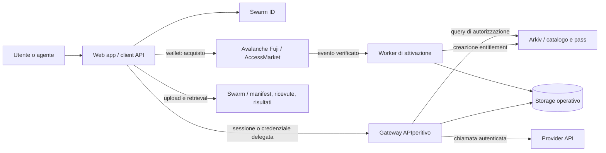

# Architettura del sistema

## Componenti

Il worker e il gateway sono moduli dello stesso processo server nell’MVP. Il diagramma li separa per responsabilità, non per indicare un deployment già distribuito.

## Responsabilità e fonti autorevoli

| Componente | Responsabilità | Non gli compete |
|---|---|---|
| Web app | Catalogo, checkout, wallet, dashboard pass, storage utente | Autorizzare il provider o dichiarare un pagamento valido |
| Swarm ID | Accesso all’identità e alle funzioni storage | Dimostrare da solo al backend il diritto a una API |
| AccessMarket | Offerta acquistata, trasferimento fondi, split, identificativo acquisto | Leggere Arkiv o autorizzare ogni invocazione |
| Worker | Validare la prova Fuji e creare una sola attivazione | Fidarsi del callback del frontend |
| Arkiv | Catalogo interrogabile e presenza del diritto temporaneo | Conservare credenziali provider o eseguire l’API |
| Gateway | Autenticazione, pass, scope, rate limit, adapter e timeout | Mantenere valido un pass solo perché esiste nel DB locale |
| Storage operativo | Sessioni, deduplicazione, stato del worker, ricevute in attesa | Sostituire Arkiv come fonte dell’accesso temporale |
| Swarm | Byte di manifest, ricevute e risultati scelti dall’utente | Eseguire controlli di accesso alle nuove chiamate API |

## Deployment MVP

- Frontend React e TypeScript, con Vite come proposta di build.
- Backend TypeScript su Node, con Fastify come proposta di server.
- Un’istanza backend con volume persistente e SQLite per stato operativo e coda di attivazione.
- Il backend serve o espone sotto la stessa origine le rotte `/api`; i cookie di sessione restano first-party.
- Worker interno avviato con il backend, con ripresa dei job dopo restart e gestione seriale delle scritture dell’issuer.
- Contratti Solidity con Foundry per build, deploy e test.
- Adapter Arkiv, Avalanche e Swarm in package separati. Versioni da fissare dopo gli spike di compatibilità.

SQLite richiede disco durevole: il progetto così descritto non è compatibile con istanze serverless effimere o più repliche che usano copie separate del database. Per scalare serve uno store condiviso e un coordinamento dei job; questa evoluzione non è necessaria alla demo.

## Confini di fiducia

Il consumer controlla identità, wallet pagante e dati archiviati. Provider e issuer sono ammessi dall’operatore nell’MVP. L’issuer conserva la proprietà dei pass su Arkiv. L’operatore può interrompere il gateway e l’issuer ha poteri sui record: queste dipendenze vanno esplicitate.

Pagamento, pass e storage sono verificabili su sistemi distinti, ma il collegamento pagamento-attivazione è realizzato dal worker fidato. L’attività del provider non viene provata crittograficamente dalla ricevuta.

## Cache e disponibilità

I manifest immutabili possono essere memorizzati per referenza. Il catalogo può usare cache breve, ma checkout e contratto verificano la vendibilità effettiva del piano. Nessuna cache positiva di autorizzazione tra invocazioni nell’MVP: ogni nuova chiamata interroga Arkiv sullo stato corrente.

Una subscription può aggiornare la UI dopo creazioni o modifiche. La sua connessione non decide la validità del pass. Gli errori RPC negano temporaneamente l’inoltro e producono un errore di servizio verificabile.
