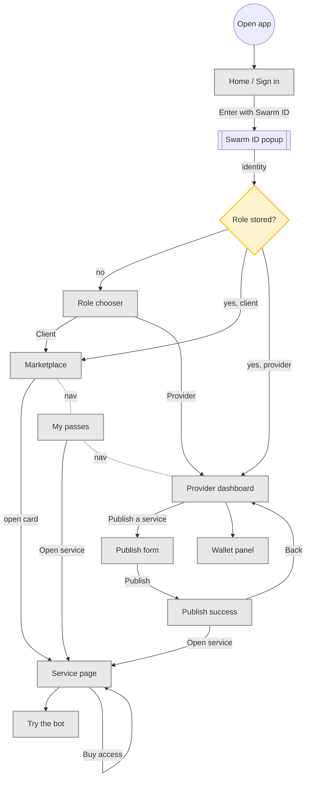

# Master screen map

All screens of the web app and how they connect. Nav bar (Marketplace · My passes · Provider) is reachable from every signed-in screen.

External proof pages (open in a new tab, not part of the app): Arkiv Data Explorer (listing, pass, receipt), Tiramisu block explorer (Arkiv tx, writer balance), Snowtrace (payment, claim, send), Swarm gateway (manifest bytes).
