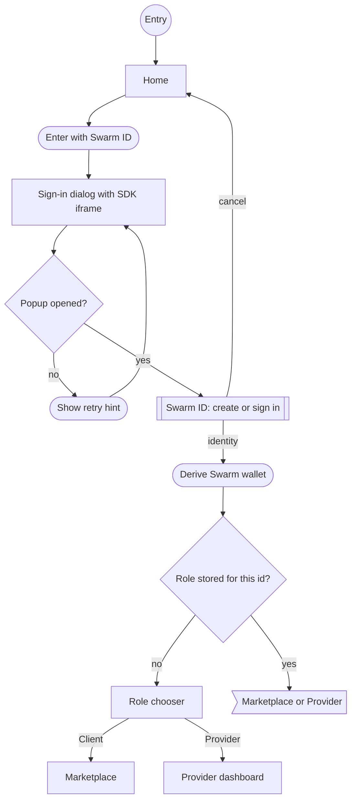

# UC-001 Sign in with Swarm ID and choose a role — flow

```mermaid
graph TD
    Start((Entry)) --> Home[Home]
    Home --> Click([Enter with Swarm ID])
    Click --> Dialog[Sign-in dialog with SDK iframe]
    Dialog --> Popup{Popup opened?}
    Popup -->|no| Blocked([Show retry hint])
    Blocked --> Dialog
    Popup -->|yes| SwarmID[[Swarm ID: create or sign in]]
    SwarmID -->|cancel| Home
    SwarmID -->|identity| Derive([Derive Swarm wallet])
    Derive --> Stored{Role stored for this id?}
    Stored -->|no| Role[Role chooser]
    Stored -->|yes| Route>Marketplace or Provider]
    Role -->|Client| Market[Marketplace]
    Role -->|Provider| Prov[Provider dashboard]

    classDef screen fill:#e8e8e8,stroke:#999,stroke-width:2px
    classDef decision fill:#fff3cd,stroke:#ffc107,stroke-width:2px
    classDef action fill:#d4edda,stroke:#28a745,stroke-width:1px
    classDef error fill:#f8d7da,stroke:#dc3545,stroke-width:1px
    classDef chain fill:#e7f1ff,stroke:#0d6efd,stroke-width:1px
```
