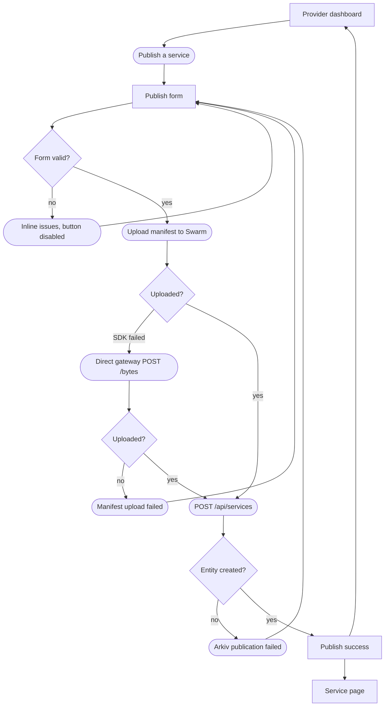

# UC-002 Publish a service — flow

```mermaid
graph TD
    Prov[Provider dashboard] --> Btn([Publish a service])
    Btn --> Form[Publish form]
    Form --> Valid{Form valid?}
    Valid -->|no| Issues([Inline issues, button disabled])
    Issues --> Form
    Valid -->|yes| Upload([Upload manifest to Swarm])
    Upload --> UpOK{Uploaded?}
    UpOK -->|SDK failed| Direct([Direct gateway POST /bytes])
    Direct --> UpOK2{Uploaded?}
    UpOK2 -->|no| ErrUp([Manifest upload failed])
    ErrUp --> Form
    UpOK -->|yes| Arkiv([POST /api/services])
    UpOK2 -->|yes| Arkiv
    Arkiv --> ArkOK{Entity created?}
    ArkOK -->|no| ErrArk([Arkiv publication failed])
    ErrArk --> Form
    ArkOK -->|yes| Success[Publish success]
    Success --> Service[Service page]
    Success --> Prov

    classDef screen fill:#e8e8e8,stroke:#999,stroke-width:2px
    classDef decision fill:#fff3cd,stroke:#ffc107,stroke-width:2px
    classDef action fill:#d4edda,stroke:#28a745,stroke-width:1px
    classDef error fill:#f8d7da,stroke:#dc3545,stroke-width:1px
    classDef chain fill:#e7f1ff,stroke:#0d6efd,stroke-width:1px
```
