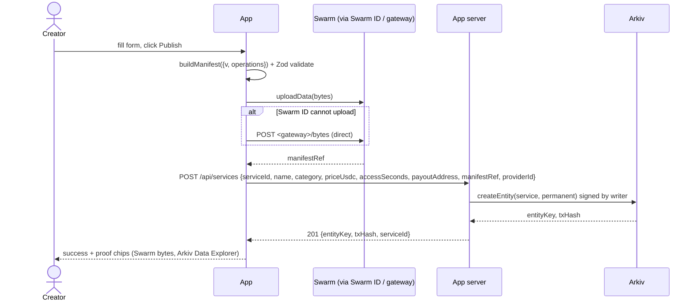

# UC-002 Publish a service — sequence

```mermaid
sequenceDiagram
    actor Creator
    participant App
    participant Swarm as Swarm (via Swarm ID / gateway)
    participant API as App server
    participant Arkiv

    Creator->>App: fill form, click Publish
    App->>App: buildManifest({v, operations}) + Zod validate
    App->>Swarm: uploadData(bytes)
    alt Swarm ID cannot upload
        App->>Swarm: POST <gateway>/bytes (direct)
    end
    Swarm-->>App: manifestRef
    App->>API: POST /api/services {serviceId, name, category, priceUsdc, accessSeconds, payoutAddress, manifestRef, providerId}
    API->>Arkiv: createEntity(service, permanent) signed by writer
    Arkiv-->>API: entityKey, txHash
    API-->>App: 201 {entityKey, txHash, serviceId}
    App-->>Creator: success + proof chips (Swarm bytes, Arkiv Data Explorer)
```
