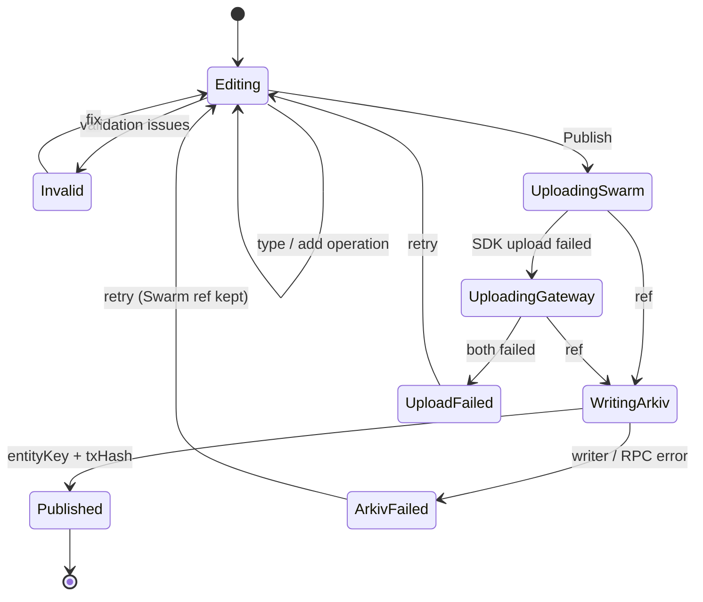

# UC-002 Publish a service — states

```mermaid
stateDiagram-v2
    [*] --> Editing
    Editing --> Editing: type / add operation
    Editing --> Invalid: validation issues
    Invalid --> Editing: fix
    Editing --> UploadingSwarm: Publish
    UploadingSwarm --> UploadingGateway: SDK upload failed
    UploadingSwarm --> WritingArkiv: ref
    UploadingGateway --> WritingArkiv: ref
    UploadingGateway --> UploadFailed: both failed
    UploadFailed --> Editing: retry
    WritingArkiv --> Published: entityKey + txHash
    WritingArkiv --> ArkivFailed: writer / RPC error
    ArkivFailed --> Editing: retry (Swarm ref kept)
    Published --> [*]
```
