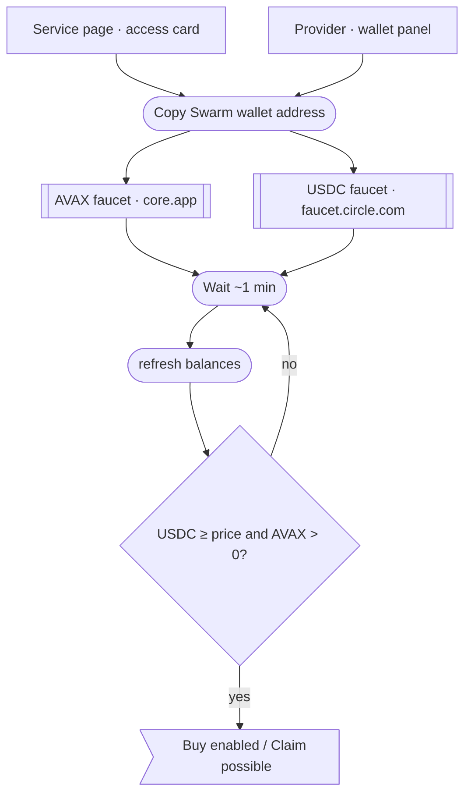

# UC-003 Fund the Swarm wallet — flow

```mermaid
graph TD
    Service[Service page · access card] --> Addr([Copy Swarm wallet address])
    Wallet[Provider · wallet panel] --> Addr
    Addr --> Avax[[AVAX faucet · core.app]]
    Addr --> Usdc[[USDC faucet · faucet.circle.com]]
    Avax --> Wait([Wait ~1 min])
    Usdc --> Wait
    Wait --> Refresh([refresh balances])
    Refresh --> Enough{USDC ≥ price and AVAX > 0?}
    Enough -->|no| Wait
    Enough -->|yes| Ready>Buy enabled / Claim possible]

    classDef screen fill:#e8e8e8,stroke:#999,stroke-width:2px
    classDef decision fill:#fff3cd,stroke:#ffc107,stroke-width:2px
    classDef action fill:#d4edda,stroke:#28a745,stroke-width:1px
    classDef error fill:#f8d7da,stroke:#dc3545,stroke-width:1px
    classDef chain fill:#e7f1ff,stroke:#0d6efd,stroke-width:1px
```
