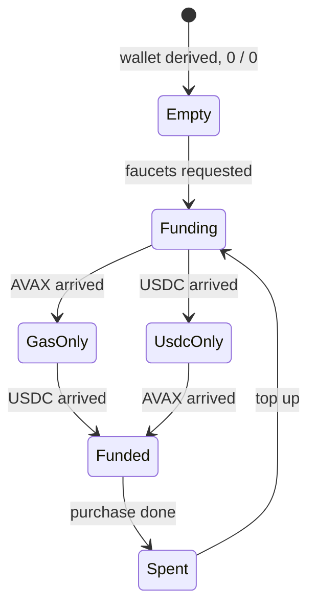

# UC-003 Fund the Swarm wallet — states

```mermaid
stateDiagram-v2
    [*] --> Empty: wallet derived, 0 / 0
    Empty --> Funding: faucets requested
    Funding --> GasOnly: AVAX arrived
    Funding --> UsdcOnly: USDC arrived
    GasOnly --> Funded: USDC arrived
    UsdcOnly --> Funded: AVAX arrived
    Funded --> Spent: purchase done
    Spent --> Funding: top up
```
