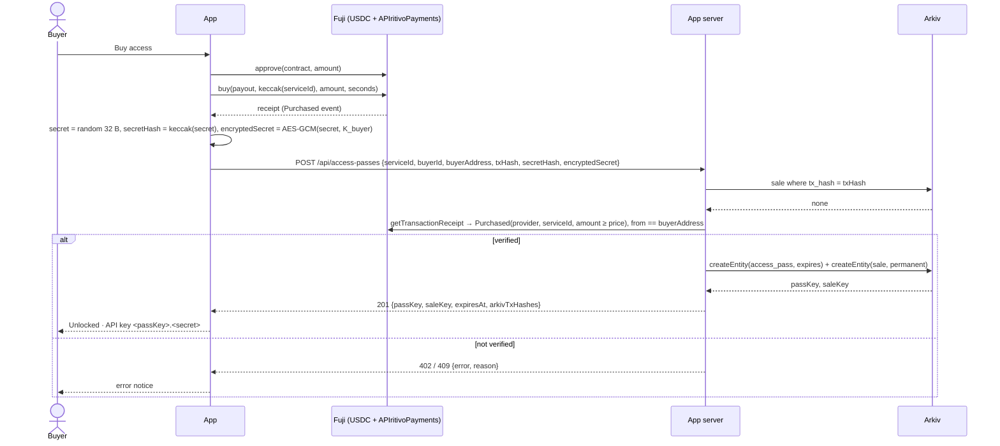

# UC-004 Buy access to a service — sequence

```mermaid
sequenceDiagram
    actor Buyer
    participant App
    participant Fuji as Fuji (USDC + APIritivoPayments)
    participant API as App server
    participant Arkiv

    Buyer->>App: Buy access
    App->>Fuji: approve(contract, amount)
    App->>Fuji: buy(payout, keccak(serviceId), amount, seconds)
    Fuji-->>App: receipt (Purchased event)
    App->>App: secret = random 32 B, secretHash = keccak(secret), encryptedSecret = AES-GCM(secret, K_buyer)
    App->>API: POST /api/access-passes {serviceId, buyerId, buyerAddress, txHash, secretHash, encryptedSecret}
    API->>Arkiv: sale where tx_hash = txHash
    Arkiv-->>API: none
    API->>Fuji: getTransactionReceipt → Purchased(provider, serviceId, amount ≥ price), from == buyerAddress
    alt verified
        API->>Arkiv: createEntity(access_pass, expires) + createEntity(sale, permanent)
        Arkiv-->>API: passKey, saleKey
        API-->>App: 201 {passKey, saleKey, expiresAt, arkivTxHashes}
        App-->>Buyer: Unlocked · API key <passKey>.<secret>
    else not verified
        API-->>App: 402 / 409 {error, reason}
        App-->>Buyer: error notice
    end
```
