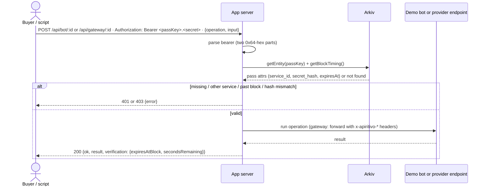

# UC-005 Call a purchased API — sequence

```mermaid
sequenceDiagram
    actor Caller as Buyer / script
    participant API as App server
    participant Arkiv
    participant Up as Demo bot or provider endpoint

    Caller->>API: POST /api/bot/:id or /api/gateway/:id · Authorization: Bearer <passKey>.<secret> · {operation, input}
    API->>API: parse bearer (two 0x64-hex parts)
    API->>Arkiv: getEntity(passKey) + getBlockTiming()
    Arkiv-->>API: pass attrs (service_id, secret_hash, expiresAt) or not found
    alt missing / other service / past block / hash mismatch
        API-->>Caller: 401 or 403 {error}
    else valid
        API->>Up: run operation (gateway: forward with x-apiritivo-* headers)
        Up-->>API: result
        API-->>Caller: 200 {ok, result, verification: {expiresAtBlock, secondsRemaining}}
    end
```
