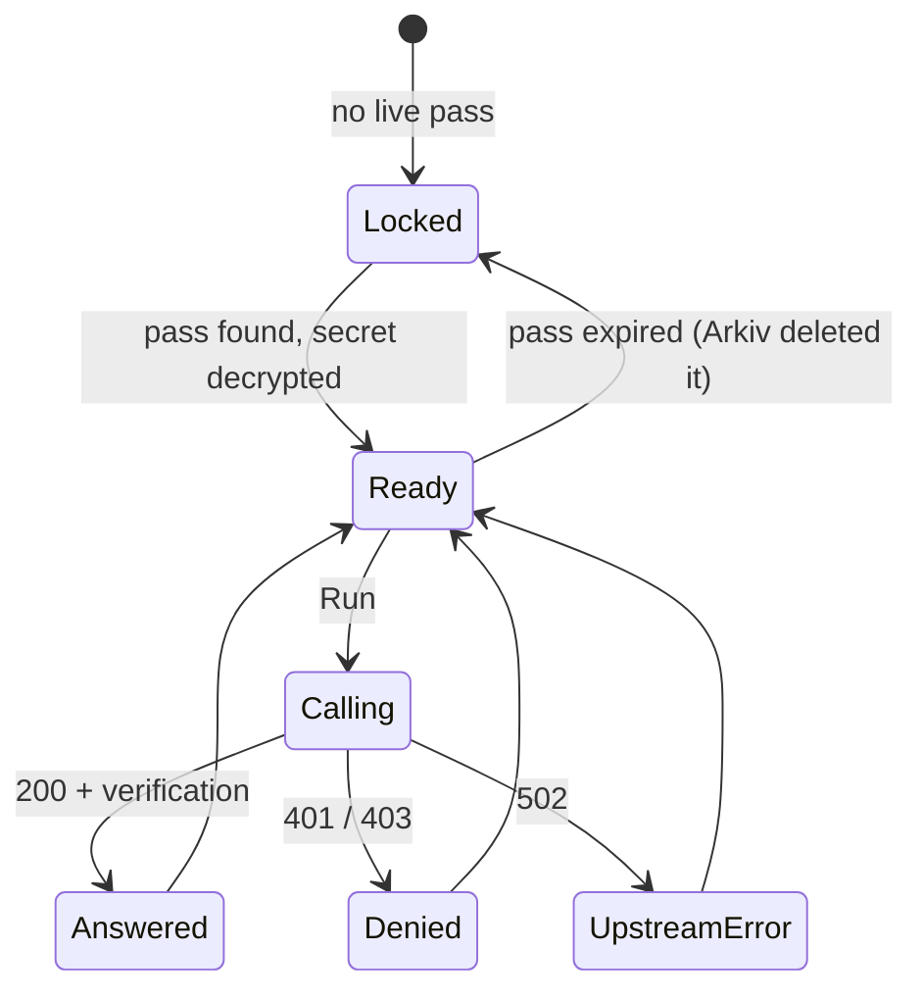

# UC-005 Call a purchased API — states

```mermaid
stateDiagram-v2
    [*] --> Locked: no live pass
    Locked --> Ready: pass found, secret decrypted
    Ready --> Calling: Run
    Calling --> Answered: 200 + verification
    Calling --> Denied: 401 / 403
    Calling --> UpstreamError: 502
    Answered --> Ready
    Denied --> Ready
    UpstreamError --> Ready
    Ready --> Locked: pass expired (Arkiv deleted it)
```
