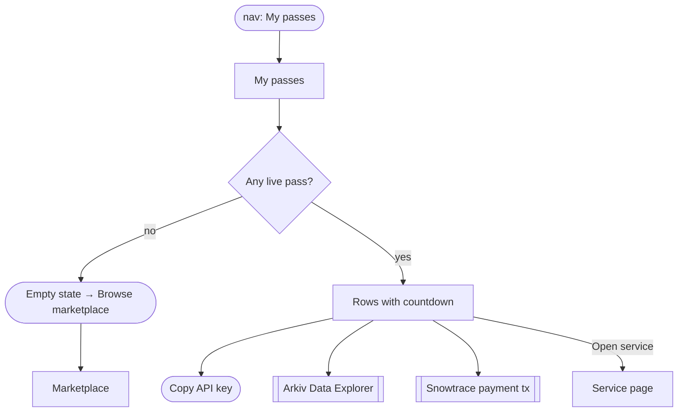

# UC-006 Review my passes and expiry — flow

```mermaid
graph TD
    Nav([nav: My passes]) --> Passes[My passes]
    Passes --> Any{Any live pass?}
    Any -->|no| Empty([Empty state → Browse marketplace])
    Empty --> Market[Marketplace]
    Any -->|yes| Rows[Rows with countdown]
    Rows --> Copy([Copy API key])
    Rows --> Explorer[[Arkiv Data Explorer]]
    Rows --> Tx[[Snowtrace payment tx]]
    Rows -->|Open service| Service[Service page]

    classDef screen fill:#e8e8e8,stroke:#999,stroke-width:2px
    classDef decision fill:#fff3cd,stroke:#ffc107,stroke-width:2px
    classDef action fill:#d4edda,stroke:#28a745,stroke-width:1px
    classDef error fill:#f8d7da,stroke:#dc3545,stroke-width:1px
    classDef chain fill:#e7f1ff,stroke:#0d6efd,stroke-width:1px
```
