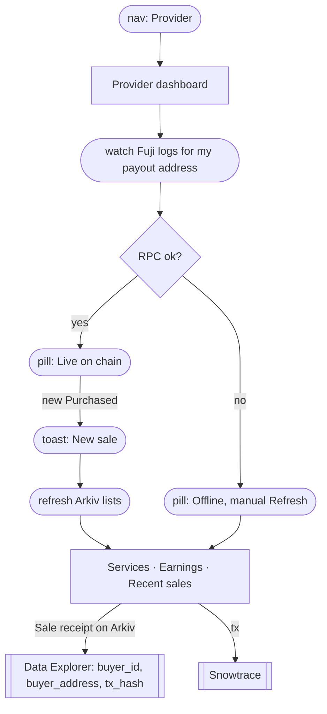

# UC-007 Track sales and verify on Arkiv — flow

```mermaid
graph TD
    Nav([nav: Provider]) --> Prov[Provider dashboard]
    Prov --> Watch([watch Fuji logs for my payout address])
    Watch --> Live{RPC ok?}
    Live -->|no| Offline([pill: Offline, manual Refresh])
    Live -->|yes| Pill([pill: Live on chain])
    Pill -->|new Purchased| Toast([toast: New sale])
    Toast --> Reload([refresh Arkiv lists])
    Reload --> Lists[Services · Earnings · Recent sales]
    Offline --> Lists
    Lists -->|Sale receipt on Arkiv| Explorer[[Data Explorer: buyer_id, buyer_address, tx_hash]]
    Lists -->|tx| Snow[[Snowtrace]]

    classDef screen fill:#e8e8e8,stroke:#999,stroke-width:2px
    classDef decision fill:#fff3cd,stroke:#ffc107,stroke-width:2px
    classDef action fill:#d4edda,stroke:#28a745,stroke-width:1px
    classDef error fill:#f8d7da,stroke:#dc3545,stroke-width:1px
    classDef chain fill:#e7f1ff,stroke:#0d6efd,stroke-width:1px
```
