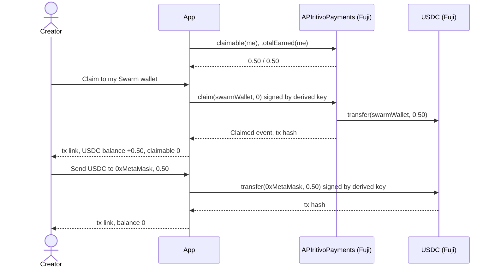

# UC-008 Claim earnings and move funds — sequence

```mermaid
sequenceDiagram
    actor Creator
    participant App
    participant Contract as APIritivoPayments (Fuji)
    participant USDC as USDC (Fuji)

    App->>Contract: claimable(me), totalEarned(me)
    Contract-->>App: 0.50 / 0.50
    Creator->>App: Claim to my Swarm wallet
    App->>Contract: claim(swarmWallet, 0) signed by derived key
    Contract->>USDC: transfer(swarmWallet, 0.50)
    Contract-->>App: Claimed event, tx hash
    App-->>Creator: tx link, USDC balance +0.50, claimable 0
    Creator->>App: Send USDC to 0xMetaMask, 0.50
    App->>USDC: transfer(0xMetaMask, 0.50) signed by derived key
    USDC-->>App: tx hash
    App-->>Creator: tx link, balance 0
```
